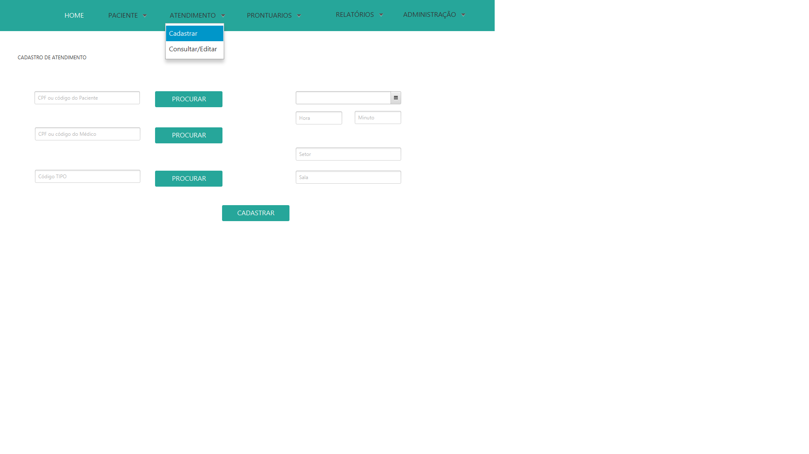

# Projeto Engenharia de Software UFPB

# Introdução

Aplicação de uso geral para cadastrar pacientes e consultar suas informações, 
análises médicas, problemas de saúde e tratamentos. 
Aplicação para inserção e consulta de dados por médicos e funcionários 

	 
	
	 

	 
	
	 

	 
	
	 

	 
	
	 

	 
	
	 

	 
	
	 

